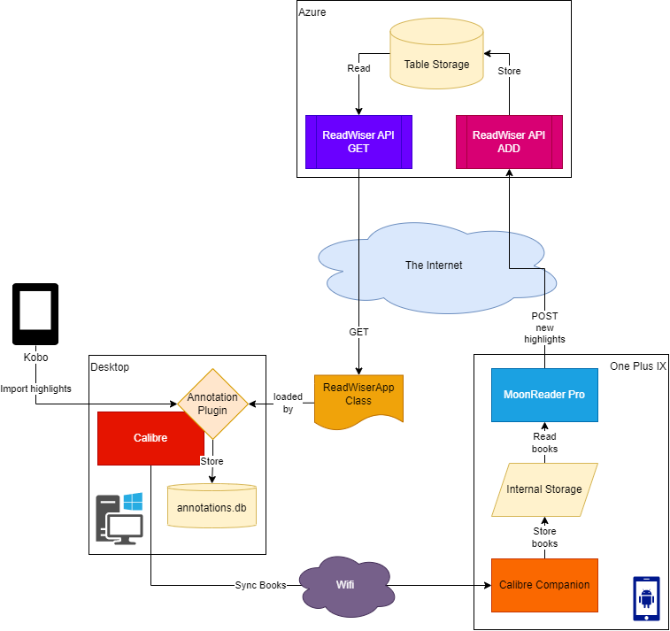

# Readwiser

## Description

Readwiser is a tool to sync book highlights and annotations from [MoonReader](https://play.google.com/store/apps/details?id=com.flyersoft.moonreaderp&hl=nl&gl=US) (the best e-reader for Android) to [Calibre](https://calibre-ebook.com/). I looked high and low for a solution to this and since I couldn't find any, I decided to build my own.

> It uses the fact that MoonReader integrates with the Readwise API and allows you to change the API endpoint

This repository contains the API that mimicks the Readwise API and stores the received notes & highlights.

It also provides endpoints to retrieve that data. These are implemented by my own extension for the excellent [Calibre Annotations plugin](https://www.mobileread.com/forums/showthread.php?t=241206), the code for which can be found [here](https://github.com/bramvandenbussche/calibre-annotations/blob/feature/readwiser-importer/readers/ReadWiserApp.py).

The following schematic shows how the whole system works:



## Getting Started

If you'd like to run this API yourself, you can. Follow the steps below to get started.

Before you start, generate a secure token to protect your API from unwanted calls, this can be any strong password, e.g 48 random characters.

> ⚠️ Keep this value secret.

### Readwiser API

You can run the Readwiser API via Docker by using this docker-compose.yml file:

```docker-compose

name: readwiser
services:

  api:
    build: .
    container_name: readwiser-api
    environment:
      "ApiKey": "<generate a random string>"

    ports:
      - 5113:80 # Pick whichever port you would like to expose

  mongo:
    container_name: mongo
    image: mongo
    ports:
      - 27017:27017
    volumes:
      - ./mongodb_data:/data/db # Choose a location for your mongo data
    
```

You can test that your API is running by using the request defined in [rest-client.http](docs/rest-client.http).

> ℹ️ You'll need to open the file with [Visual Studio Code](https://visualstudio.microsoft.com/) and have the [Rest-Client plugin](https://marketplace.visualstudio.com/items?itemName=humao.rest-client) installed to be able to run the requests.

Alternatively you can use any other API testing tool, e.g [Postman](https://www.postman.com/) to test the API with the documentation provided.

### Configuring Moon Reader Pro

1. Open your **bookmarks** from inside of an ebook
2. Tap the **Settings icon** in the bottom right
3. Tap the **Settings** icon next to **Share new highlights and notes to Readwise automatically**
4. Add the secure API token you generated in the **Token** field
5. Change the **Readwise Url** field to the endpoint of your API. It looks like this: `https://<your-website-address>/api/highlight`
6. Tap **OK**

If your API is up and running, any new annotations you make will be synced automatically if you ticked the box in settings. You can verifiy this by querying the API yourself, or by checking your Storage Account with a tool like [Azure Storage Explorer](https://azure.microsoft.com/en-us/products/storage/storage-explorer/#overview). You'll find your annotations in a table called `Highlight`.

### Calibre Annotations plugin

In order to download the data from your API into Calibre, you first need to install the [Annotations plugin](https://www.mobileread.com/forums/showthread.php?t=241206) from within the Calibre plugin manager. After that, follow the steps below to get it setup.

#### Setup

- Navigate to your [Calibre installation folder](https://www.mobileread.com/forums/showthread.php?t=309945)
- Open the `Calibre Settings\plugins` folder
- Locate and open `annotations.json` with your favorite text editor (e.g [Notepad++](https://notepad-plus-plus.org/downloads/))
- Add the following lines:

``` json
    "readwiser_api_base_url": "ADD_BASE_URL_HERE",
    "readwiser_api_key": "ADD_YOUR_SECURE_TOKEN_HERE",
```

> ⚠️ Take care to ensure that there's a comma after the previous line or your json format will be invalid

> ℹ️ Your BaseUrl should look like this: `https://<your-web-address>`

- Save the file, and restart Calibre

### Using the plugin

> ℹ️ If your API isn't running as AlwaysOn, the first call might take some time

#### Import annotations for a single book

- Select the book you want to import for
- Go to the Annotations plugin
- Select `Import annotations from > ReadWiser`
- If annotations are found, you'll get the default import dialog showing the selected book
  - If no annotations are found, you'll get a message telling you so
- You can **preview** the loaded annotations and **Import** them if you want

#### Import all annotations

- Make sure to deselect any book / row
- Go to the Annotations plugin
- Select `Import annotations from > ReadWiser`
- If annotations are found, you'll get the default import dialog showing all books for which annotations are found
  - If no annotations are found, you'll get a message telling you so
- After this you can **preview** the annotations, **select** which books to import for and eventually click **Import Annotations**

## Development

### Docker

To run the application in Docker, using a local version of MongoDB, also running in Docker, use the following command:

``` powershell
docker build .; docker compose up
```
